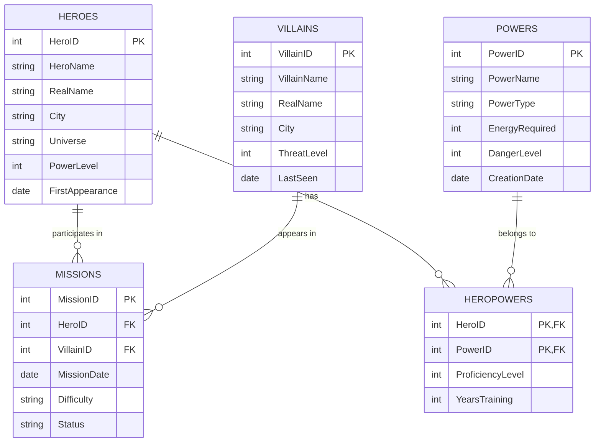
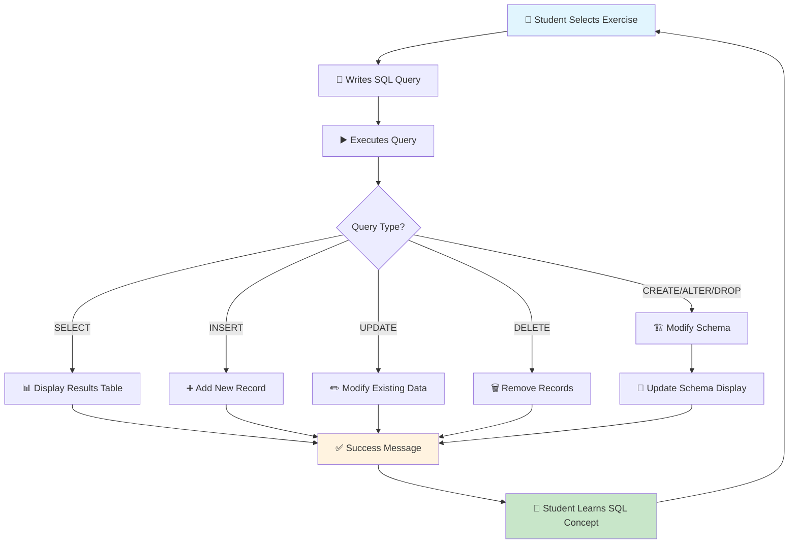
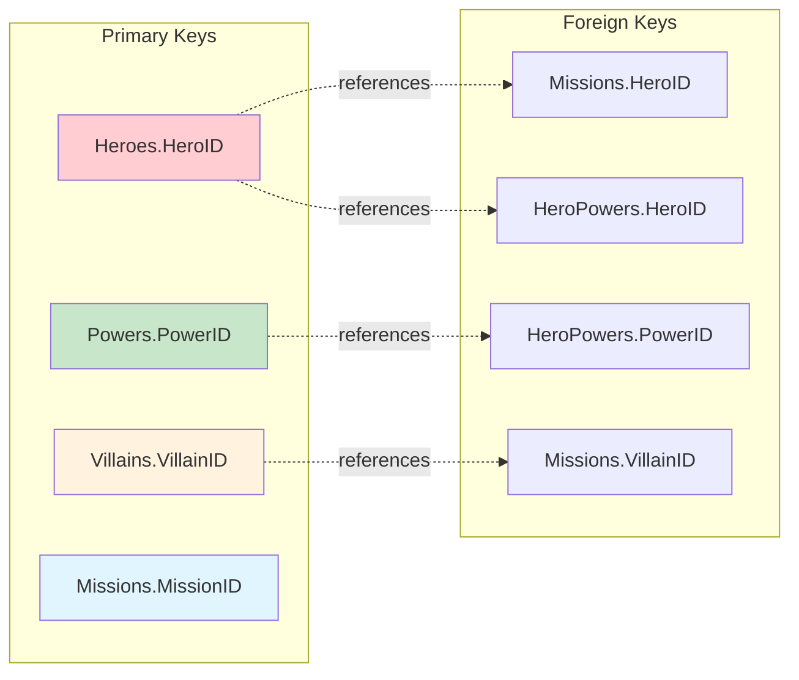
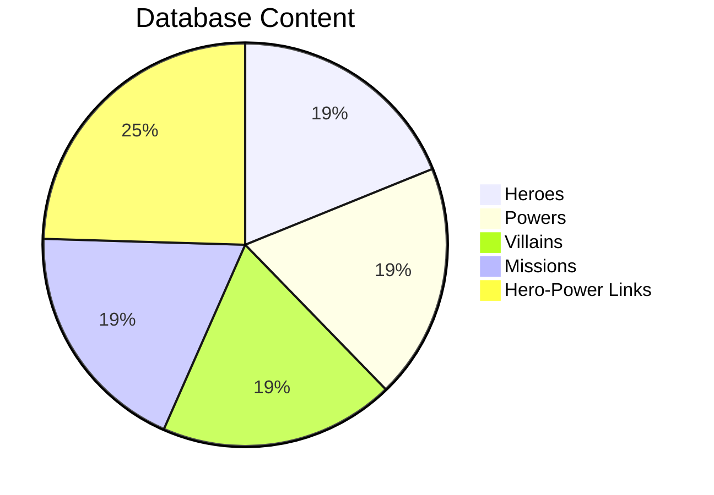
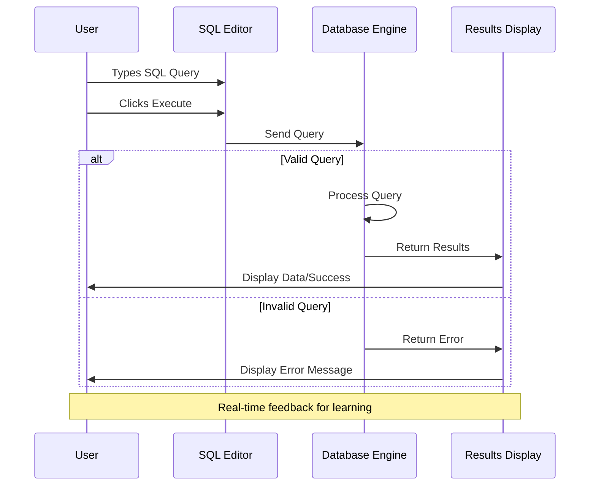
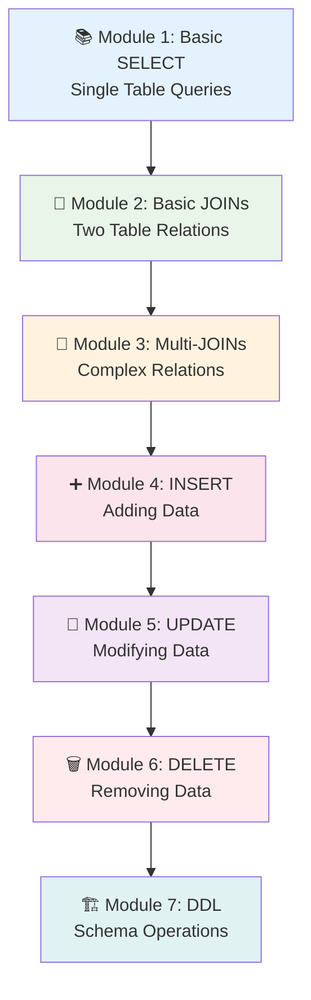

# 📊 Interactive Database Schema Diagrams

## Mermaid ERD (GitHub Native Support)

## 🎯 Relationship Types Explained

### **One-to-Many (1:N)**
- **Heroes → Missions**: One hero can have many missions
- **Villains → Missions**: One villain can appear in many missions

### **Many-to-Many (M:N)**
- **Heroes ↔ Powers**: Implemented via HeroPowers junction table
  - Heroes can have multiple powers
  - Powers can belong to multiple heroes

## 📊 Flow Diagram

## 🗂️ Table Relationship Details

### Primary-Foreign Key Relationships

## 📈 Data Volume Overview

## 🔄 Query Execution Flow

## 🎓 Learning Path Through Schema

---

**🎯 These visual representations help students understand:**
- Table relationships and foreign keys
- Data flow and query execution
- Learning progression through modules
- Database design principles

*View these diagrams on GitHub for interactive functionality!* 🚀